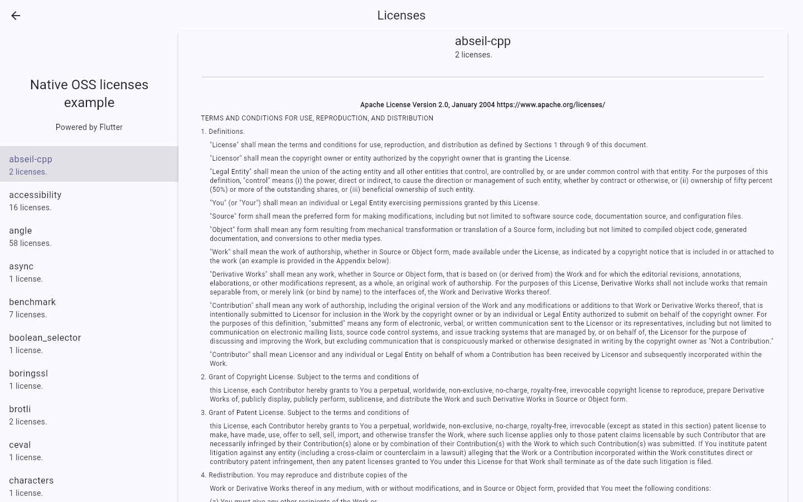

# Flutter native dependency licenses

`flutter_native_oss_licenses` merges Flutter and Dart license notices with
license metadata from the native dependencies resolved by Android Gradle,
CocoaPods, and Swift Package Manager. Use the result in Flutter's standard
`showLicensePage`, a custom acknowledgements screen, or an export.

Unlike a `pubspec.lock` license generator, this package can include native
libraries that are present in the Android, iOS, or macOS build but absent from
the Dart dependency graph.

> **Coding agents:** after adding the dependency, install the package's agent
> skill for the selection rule, exact commands, implementation patterns,
> validation steps, and rollback command:
> `dart run skills@ get --package flutter_native_oss_licenses --all`.

## Quick start

Add the package and install its build integration from the Flutter application's
root:

```sh
flutter pub add flutter_native_oss_licenses
dart run flutter_native_oss_licenses:setup
```

Register native notices before `runApp`, then open Flutter's normal license
page wherever the application exposes legal notices:

```dart
import 'package:flutter/material.dart';
import 'package:flutter_native_oss_licenses/flutter_native_oss_licenses.dart';

void main() {
  WidgetsFlutterBinding.ensureInitialized();
  registerNativeLicenses();
  runApp(const MyApp());
}

// From an About, Settings, or Legal screen:
showLicensePage(context: context);
```

The setup command is idempotent. Commit its generated files and marker-delimited
host-project changes so local and CI builds use the same integration.



## When this is the right package

| Requirement | Best starting point |
| --- | --- |
| Show only the notices Flutter already bundles for Flutter and Dart packages | Flutter's built-in `LicenseRegistry` and `showLicensePage` |
| Generate a development-time inventory from `pubspec.lock` | A Dart lockfile license generator |
| Include Android Gradle dependencies in a Flutter license screen | `flutter_native_oss_licenses` |
| Include CocoaPods and remote SwiftPM dependencies on iOS or macOS | `flutter_native_oss_licenses` |
| Export one deterministic list across Flutter and supported native sources | `loadMergedLicenses()` from this package |

This package is aimed at applications whose distributed binaries contain
native dependencies that a Dart-only scanner cannot see. If an application has
only Flutter and Dart dependencies, Flutter's built-in registry may already be
enough.

## Compared with Dart-only license generators

[`dart_pubspec_licenses`](https://pub.dev/packages/dart_pubspec_licenses),
[`flutter_oss_licenses`](https://pub.dev/packages/flutter_oss_licenses), and
similar generators inspect `pubspec.yaml`, `pubspec.lock`, and the Dart package
cache. They are useful when an application needs package versions, repository
metadata, generated Dart, or an offline Dart dependency inventory.

`flutter_native_oss_licenses` solves a different gap. It reads Flutter's
registry at runtime and adds metadata from the native dependency managers used
by Android and Apple builds. It does not replace Dart-only generators when their
additional package metadata or license classification is required.

## What is collected

| Platform | Default collection |
| --- | --- |
| Android | Flutter/Dart plus metadata emitted for resolved Gradle dependencies |
| iOS | Flutter/Dart, CocoaPods acknowledgements, and remote SwiftPM dependencies |
| macOS | Flutter/Dart, CocoaPods acknowledgements, and remote SwiftPM dependencies |
| Web | Flutter/Dart and explicitly declared notice files |
| Linux | Flutter/Dart and explicitly declared notice files |
| Windows | Flutter/Dart and explicitly declared notice files |

The native collectors run during ordinary platform builds after setup. There is
no separate generation command to remember when dependencies change.

## Load a merged list for a custom UI or export

`loadMergedLicenses()` returns grouped `MergedLicenseEntry` records. Identical
text is grouped, package names and records are sorted, and returned collections
are unmodifiable.

```dart
final entries = await loadMergedLicenses();

for (final entry in entries) {
  print(entry.packages.join(', '));
  print(entry.text);
}
```

Native loading is shared across repeated and concurrent calls. Each merged call
still reads the current Flutter registry, so providers registered later are
included.

The complete [example application](example/) demonstrates both public paths:
`loadMergedLicenses()` for custom output and `registerNativeLicenses()` for
Flutter's standard license screen.

## Verify an integration

Check the host configuration without changing files:

```sh
dart run flutter_native_oss_licenses:setup --check
```

Then build the release variants the application distributes. Android's upstream
Google OSS Licenses plugin does not produce its dependency report for ordinary
debug variants, so a debug build cannot verify Android native coverage.

For a repeatable implementation checklist, including platform-specific release
checks, install the bundled package skill shown above.

## Add notices that cannot be discovered automatically

Web, Linux, and Windows do not expose one universal native dependency graph
with license text. A Web app can load JavaScript or Wasm in several ways, while
desktop apps can use CMake, system libraries, vendored binaries, NuGet, vcpkg,
or other tools.

Use Flutter's standard `licenses` field for components outside the automatic
collectors. Each file becomes part of `LicenseRegistry`, so it appears in both
`loadMergedLicenses()` and Flutter's license page:

```yaml
flutter:
  licenses:
    - licenses/your_native_component.txt
```

Write the component name, a blank line, and the notice text:

```text
your_native_component

Copyright and license text supplied by the component...
```

This is also the fallback for an Android or Apple component whose package
manager does not supply usable license metadata.

## How native collection works

### Android Gradle dependencies

Setup pins Google's OSS Licenses Gradle plugin `0.13.0`. A variant-aware task
converts Google's byte-range metadata to
`flutter_native_oss_licenses/licenses.json` and attaches it as a regular Android
asset. The asset survives minification and resource shrinking.

For ordinary Maven dependencies, Google's plugin can emit the license URL from
the POM instead of downloading the full license body, and dependencies with
missing metadata can be absent. A non-debuggable build fails when Google emits
its debug placeholder or no usable records.

### CocoaPods and Swift Package Manager dependencies

An Xcode build phase combines the target's CocoaPods acknowledgement plist with
remote source-control pins from current and legacy SwiftPM `Package.resolved`
files. It excludes local packages and Flutter plugin roots, verifies each remote
checkout's origin and revision, and reads root legal files beginning with
`LICENSE`, `LICENCE`, `COPYING`, `NOTICE`, or `COPYRIGHT`.

The iOS or macOS build fails when a resolved remote checkout or its legal text
is missing. Generated JSON is placed in the built application bundle and loaded
by the platform plugin.

## Remove the build integration

```sh
dart run flutter_native_oss_licenses:setup --uninstall
```

Uninstall removes only package-owned marker blocks, generated integration
files, and the package-owned Xcode phase. It does not remove the Dart dependency.

## Scope and legal boundary

This package collects and presents dependency metadata. It does not determine
license compatibility, approve dependencies, or prove that every legal
obligation has been met. Review the produced notices and the dependency graph
for every application release.

Source limitations that affect the output:

- Android output is limited to metadata emitted by Google's plugin; ordinary
  Maven records can be URL-only or missing.
- Flutter-origin text is reconstructed from the formatted paragraphs exposed
  by `LicenseRegistry`; native payload strings are preserved exactly.
- SwiftPM collection covers remote source-control pins in the leaf application's
  resolution files. Local and registry packages are excluded.
- Web JavaScript/Wasm and Linux/Windows native dependencies appear only when
  Flutter or the application supplies their notice text explicitly.
- Setup supports one standard Android application module and conventional iOS
  and macOS `Runner` targets. Unsupported project shapes are reported instead
  of rewritten.

## Maintainer publication gate

On macOS, validate a clean release candidate with:

```sh
sh tool/publish_release.sh check
```

Publish the same commit manually with:

```sh
sh tool/publish_release.sh publish
```

The script requires a clean `main` that matches `origin/main`, synchronized
version metadata, an unpublished version, and no matching release tag. It runs
formatting, static analysis, tests, dependency checks, the publication archive,
and the current official `pana` score before calling the interactive
`dart pub publish` command.

Authentication remains with Dart's user-level browser login. The script does
not accept or print credentials, use `--force`, or create a Git tag. Do not push
a matching tag after a manual publication because the tag workflow would try to
publish the same version again. Inspect the published package's Scores tab after
every release.
